# Hi there, I'm Arda! 👋

<div align="center">


</div>

<div align="center">


</div>

## 🚀 About Me

```typescript
const arda = {
    age: 17,
    location: "İzmir, Turkey 🇹🇷",
    experience: "5+ years of coding journey",
    github_since: "2020 🎂",
    passion: "Turning code into creativity",
    specialties: ["Full Stack Development", "Game Modding", "ERP Systems", "AI/ML"],
    current_focus: ["Enterprise Solutions", "Cloud Architecture", "Open Source", "Mobile Development"],
    fun_fact: "I debug code faster than I debug my life 🐛",
    motto: "Code is poetry, logic is art ✨",
    languages_mastered: "25+",
    projects_completed: "30+",
    daily_drive: "Building solutions that matter"
};
```

<div align="center">

### 💫 What I'm Up To

🔭 Currently working on **ERP systems & enterprise-grade applications**  
🌱 Learning **blockchain development, microservices & DevOps**  
👯 Looking to collaborate on **innovative open source projects**  
💬 Ask me about **full stack development, game engines, or any tech stack**  
⚡ Fun fact: **I've been coding since I was 12 - it's my superpower** 🦸‍♂️  
🎯 **5+ years on GitHub** building, learning, and innovating  
🏆 **Specialized in enterprise solutions & scalable architectures**

</div>

---

## 🛠️ Tech Arsenal

<div align="center">

### 💻 Programming Languages


### 🎨 Frontend Development


### ⚙️ Backend & Databases


### 🔧 DevOps, Tools & Enterprise


### 🎮 Game Development & Modding


</div>

---

## 💼 Professional Experience

<div align="center">

<table>
<tr>
<td align="center" width="25%">

<br />
<strong>Enterprise Resource Planning</strong>
<br />
<sub>Custom ERP solutions</sub>
</td>
<td align="center" width="25%">

<br />
<strong>Full Stack Development</strong>
<br />
<sub>End-to-end solutions</sub>
</td>
<td align="center" width="25%">

<br />
<strong>Mobile Applications</strong>
<br />
<sub>Cross-platform apps</sub>
</td>
<td align="center" width="25%">

<br />
<strong>Game Development</strong>
<br />
<sub>Mods & custom engines</sub>
</td>
</tr>
</table>

</div>

---

<div align="center">


</div>

---

## 🎯 Featured Projects

<div align="center">

<table>
<tr>
<td width="50%">

### ✅ TaskMaster
**Modern Todo List Application**
- 🌙 Dark mode support
- 📱 Responsive design  
- 💾 Local storage integration
- ⚡ Lightning fast performance
- 🎨 Beautiful UI/UX

<div align="center">

[](https://geoarda.github.io/TaskMaster/)
[](https://github.com/geoarda/TaskMaster)

</div>

</td>
<td width="50%">

### 🧮 CodeCalcPro  
**Advanced Calculator App**
- 🎨 Multiple color themes
- 📐 Advanced mathematical operations
- 🔧 Clean, intuitive interface
- 📱 Mobile-first design
- ⚡ Real-time calculations

<div align="center">

[](https://geoarda.github.io/CodeCalcPro/)
[](https://github.com/geoarda/CodeCalcPro)

</div>

</td>
</tr>
<tr>
<td width="50%">

### 🖥️ PC Parts Store
**E-commerce Platform**  
- 🛒 Full shopping cart functionality
- 💳 Secure payment integration
- 🔍 Advanced search & filters  
- 📊 Admin dashboard
- 📦 Inventory management

<div align="center">

[](http://bilgisayarparcasisatan.somee.com/)
[](#)

</div>

</td>
<td width="50%">

### 🎮 Game Mods & Engines
**Gaming Projects Portfolio**
- 🎯 Custom game mechanics
- 🎨 Enhanced visual effects  
- ⚙️ Performance optimizations
- 🔧 Modding frameworks
- 🚀 Engine integrations

<div align="center">

[](#)
[](#)

</div>

</td>
</tr>
</table>

</div>

---

## 📊 GitHub Analytics

<div align="center">


</div>

<div align="center">


</div>

---

## 🏆 Achievements & Milestones

<div align="center">


</div>

<div align="center">

<table>
<tr>
<td align="center">

<br />
<strong>Programming Languages</strong>
</td>
<td align="center">

<br />
<strong>Completed Projects</strong>  
</td>
<td align="center">

<br />
<strong>Coding Experience</strong>
</td>
<td align="center">

<br />
<strong>GitHub Journey</strong>
</td>
</tr>
</table>

</div>

---

## 📈 My Coding Journey

```mermaid
timeline
    title 5 Years of Innovation & Growth
    2020 : 🎯 Started GitHub Journey
         : 📚 First repositories & learning fundamentals
         : 🌟 Discovered passion for coding
    2021 : 🌐 Built first web applications
         : 🎮 Explored game modding & engines
         : 💻 Mastered 5+ languages
    2022 : 🚀 Advanced full-stack projects
         : 🤝 Open source contributions
         : 📊 10+ languages & frameworks
    2023 : 💼 Full-stack expertise achieved
         : 🏢 Enterprise & ERP systems
         : 🔧 15+ languages mastered
    2024-2025 : 🎓 Senior developer level
              : 🤖 AI/ML integration & automation
              : 📱 Mobile & cloud development
              : 🏆 25+ languages | 30+ projects
```

<div align="center">



</div>

---

## 💡 Technical Expertise

<div align="center">

### 🎯 Specialized Skills

<table>
<tr>
<td width="33%" align="center">

#### 🏢 Enterprise Development
- ERP Systems Design
- Microservices Architecture
- RESTful & GraphQL APIs
- Database Optimization
- System Integration

</td>
<td width="33%" align="center">

#### 🎨 Frontend Excellence
- Modern React/Next.js
- Vue.js & Angular
- Flutter Mobile Apps
- Responsive Design
- UI/UX Best Practices

</td>
<td width="33%" align="center">

#### ⚙️ Backend Mastery
- Node.js & Express
- Python Django/Flask
- .NET Core
- Spring Boot
- Cloud Services (AWS/Azure)

</td>
</tr>
<tr>
<td width="33%" align="center">

#### 🎮 Game Development
- Unity & Unreal Engine
- Custom Modding Tools
- Game Mechanics Design
- Performance Optimization
- Lua Scripting

</td>
<td width="33%" align="center">

#### 🔄 DevOps & CI/CD
- Docker & Kubernetes
- Jenkins & GitLab CI
- Infrastructure as Code
- Monitoring & Logging
- Automated Testing

</td>
<td width="33%" align="center">

#### 📊 Data & AI
- Machine Learning Models
- Data Analysis & Visualization
- TensorFlow & PyTorch
- Database Design
- Big Data Processing

</td>
</tr>
</table>

</div>

---

## 🎵 Coding Playlist

<div align="center">

<table>
<tr>
<td align="center" width="25%">🎧</td>
<td width="75%"><strong>Lo-fi Hip Hop</strong> - For deep focus and flow state sessions</td>
</tr>
<tr>
<td align="center">🎸</td>
<td><strong>Synthwave</strong> - When building cyberpunk and futuristic projects</td>
</tr>
<tr>
<td align="center">🎹</td>
<td><strong>Classical</strong> - For complex algorithm design and problem-solving</td>
</tr>
<tr>
<td align="center">🎵</td>
<td><strong>Electronic/EDM</strong> - During late-night coding marathons</td>
</tr>
<tr>
<td align="center">🎼</td>
<td><strong>Ambient/Chill</strong> - For debugging and code reviews</td>
</tr>
</table>

</div>

---

## 🌐 Connect & Collaborate

<div align="center">

<a href="https://www.linkedin.com/in/arda-a-020bb5380/">

</a>
<a href="mailto:your-email@example.com">

</a>
<a href="#">

</a>
<a href="https://github.com/geoarda">

</a>
<a href="#">

</a>

</div>

<div align="center">
<br>

### 💼 Open for Opportunities

🚀 Freelance Projects | 🤝 Collaborations | 💡 Consulting | 🎓 Mentorship

</div>

---

<div align="center">

### 💭 Random Dev Quote


</div>

---

<div align="center">

### 🎯 Profile Insights


</div>

---

<div align="center">


<br>

**✨ "5 years of turning code into creativity, one commit at a time." ✨**

**🚀 From 2020 to 2025 - Building, Learning, Innovating, Inspiring**

<sub>Made with 💖 and ☕ by Arda</sub>

</div>
